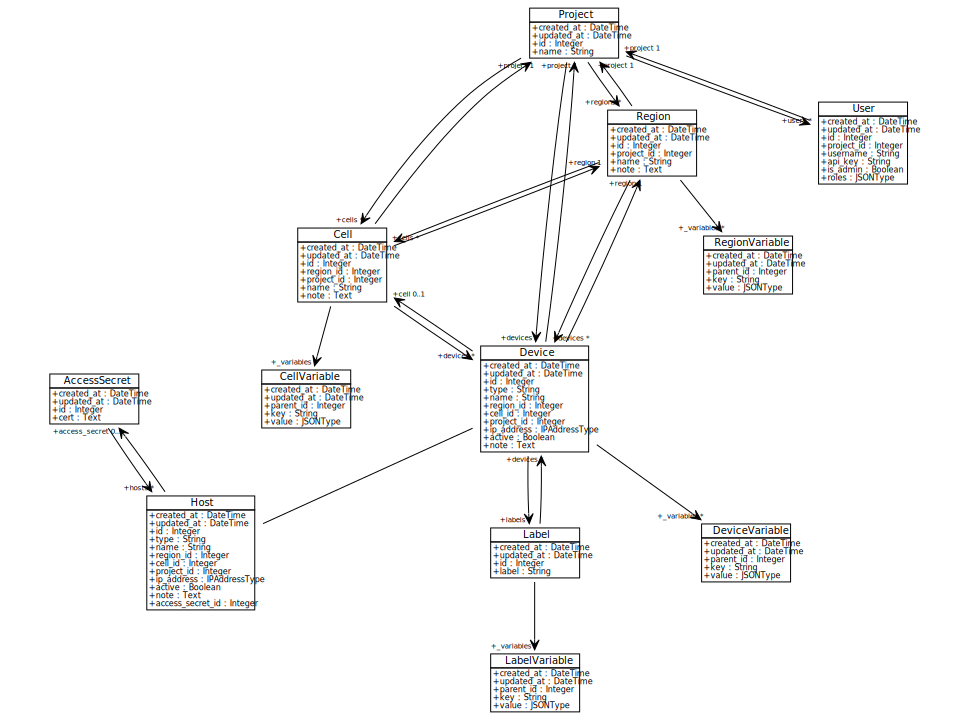

Inventory
=========

Concepts
--------

The fundamental unit of inventory in Craton is a **device**, which has
the following characteristics:

Configurability
    A device is configurable, either directly over SSH with tooling
    like Ansible or indirectly via some controller.

    Configuration can be further divided as follows:

    * Version-controlled configuration, often captured in
      playbooks. It is the responsibility of workflows to use such
      configuration.

    * Config data stored in the inventory schema.

    In either case, the ultimate source may be manual, programmatic,
    or a combination of the two.

Addressability
    A device has an IP address (specifically the control plane IP
    address).

Hierarchy
    Devices are part of a hierarchy of regions and cells; a region in
    turn is part of a project.

Labels
    Devices may be arbitrarily labeled. Such labels can describe
    physical layout -- cabinet, networking, power, etc -- along with
    logical usage -- compute service, etc. Labels are not in a
    hierarchy. (But should they be?)

    Some systems like Kubernetes use a key/value scheme for
    labels. This can be readily supported by the convention
    ``key:value`` for the label name.

A **host** is a concrete subclass of device, and corresponds to the
equivalent Ansible concept: a host is directly configurable by an
Ansible playbook over SSH. Hosts have associated SSH keys for such
access.

**Principals** interact (read and/or write) with inventory about
devices. Governance for this interaction is mediated by RBAC and
logged with respect to **change records** (including the reason for
the change). Third party governance systems like OneOps can further
structure these interactions. There are two classes of principals:

Workflows
    Capture audits about inventory; which are in turn used for any
    remediation. The pattern of usage is bottom-up.

    Workflows are pluggable. They can be refined to a number of
    levels: Ansible, OpenStack Ansible, a specific workflow for
    managing patch levels with OSA (TODO does that actually make
    sense for OSA?).

    Note that a workflow can be run any number of times, against
    different subsets of inventory. Example: migrate a specific
    cabinet, as specified by a label. Think of this distinction as
    being like an Ansible playbook vs its play.

    Because workflows also know about version-controlled config,
    perhaps they can be used for queries as well. (TODO Ansible has
    some limited ways of determining such variables; it's possible OSA
    might develop this further as well in terms of role-based scheme.)

Users
    Configure and query inventory. The pattern of usage is top-down,
    whether that's configuring a specific label or drilling down from
    a given cell.

    Users also can run workflows. This capability implies that
    workflows can be linked to roles; and that permissions include
    being the ability to run workflows.

Inventory interactions can be optionally logged. For example, if
inventory is configured to use MySQL with InnoDB as its backing store,
then all changes can be captured in the write-ahead log and reliably
streamed to Kafka for analysis.

Associated with each region, cell, label, and device are
**variables**. Here are some aspects of variables:

Description
    Variables are used to describe a device with config, auditing
    (possibly a subset of discovered facts), and other
    information. However variables do not store logging, metric, or
    monitoring information --- because of volume, such storage is best
    done in a separate database, such as timeseries DB.

Key/value pairs
    Variables are made of up key/value pairs.

Key
    Keys are strings; they are additionally restricted to be valid
    Python identifiers. We usually refer to these as **top-level
    keys**, because values can be arbitrarily complex JSON values.

    Such keys, and their prefixes, also serve as roles in Craton's
    implementation of RBAC. Keys are in a single namespace that does
    not differentiate between config or audit variables.

Value
    Values are of JSON type, and can store arbitrary data as such,
    including binary data via base64 encoding. Workflows define these
    specifics.

Scope resolution
    Variables use hierarchical scope to resolve for a specific device,
    using the following ordering:
         
      1. Region
      2. Cell
      3. Label; if a device has multiple labels, the labels are sorted
         alphanumerically
      4. Device

    Such resolution overrides at the lowest defined level, which
    allows for variables to describe a device with the "broadest
    possible brush". Overrides do not merge values, even if the value
    has keys embedded in it.

    In general, config variables should be set at the highest
    possible level; whereas audit data should be bottom up from
    device.

Metadata
    Variables are also associated with the actor that wrote
    them, along with a record of change, including a note describing
    the change.

    It may be desirable to track other metadata about a variable: is
    this intended for config, vs discovered from an audit? But note
    this might be just a question of which actor wrote this variable:
    was it a user? (Config.) Or was it a workflow? (Audit/remediation,
    possibly further identified by workflow metadata.)

Implementation
--------------

Craton's inventory is modeled using Python objects, which in turn has 
a concrete reference implementation using SQLAlchemy:

.. graphviz:: database.dot

TODO(jimbaker): implementation of the inventory concepts is a work in
progress, however, the above schema represents the current
implementation. Notably missing are principals, including workflows
and users, which will be added in the next phase of work.
